# Laporan Projek Machine Learning
### Nama: Asyfa Nabilla Rahmi
### NIM: 211351033
### Kelas: Pagi A

# Domain Projek
Dataset "Supermart Grocery Sales - Retail Analytics" adalah kumpulan data yang mencatat transaksi penjualan di sebuah supermarket. Dataset ini umumnya digunakan untuk analisis ritel dan pemahaman pola-pola penjualan di toko.

## Business Understanding
Dataset ini dapat digunakan untuk melihat jumlah transaksi dari penjualan di supermarket berdasarkan hari, tanggal, dan region.

### Problem Statement
Menganalisis pola penjualan supermarket pada berbagai tingkat waktu (harian, tanggalan) dan berdasarkan region untuk mendapatkan pemahaman yang mendalam tentang tren penjualan serta preferensi pembelian pelanggan.

### Goals
- Mengidentifikasi tren penjualan harian, mingguan, bulanan, dan tahunan untuk memahami pola pembelian pelanggan.
- Mengetahui tanggal-tanggal tertentu dengan volume penjualan tinggi atau rendah.

## Solution Statement
- Menggunakan teknik visualisasi data untuk menganalisis pola penjualan harian, mingguan, bulanan, dan tahunan.
- Memisahkan data penjualan berdasarkan region untuk memahami perbedaan preferensi pembelian di tiap wilayah.

## Data Understanding
Dataset "Supermart Grocery Sales - Retail Analytics" adalah kumpulan data yang mencatat transaksi penjualan di sebuah supermarket. Dataset ini umumnya digunakan untuk analisis ritel dan pemahaman pola-pola penjualan di toko. Dataset diambil dari kaggle dan bisa diakses di link berikut
 [Supermart Grocery Sales - Retail Analytics Dataset] 
 https://www.kaggle.com/datasets/mohamedharris/supermart-grocery-sales-retail-analytics-dataset/data

### Variabel pada Supermart Grocery Sales - Retail Analytics dataset
- Order ID (object): Untuk mengetahui order id customer
- Customer Name (object): Berisi nama-nama customer
- Category (object): Untuk mengetahui item apa saja yang dibeli oleh customer
- Sub Category (object): Untuk melihat item itu termasuk ke jenis makanan/minuman apa
- City (object): Berisi nama kota di mana item dibeli
- Order Date (datetime64[ns]): Tanggal pembelian
- Region (object): Lokasi atau wilayah geografis di mana transaksi penjualan terjadi
- Sales (int64): Total pendapatan atau jumlah uang yang diperoleh dari transaksi penjualan item di supermarket
- Discount (float64): Pengurangan harga atau potongan harga yang diberikan kepada pelanggan pada saat pembelian item tertentu
- Profit (float64): Selisih antara pendapatan atau total penjualan dengan biaya atau pengeluaran yang terkait dengan item atau transaksi penjualan tersebut

## Data Preparation
Data yang diambil didapatkan dari kaggle dengan judul Supermart Grocery Sales - Retail Analytics dan link yang bisa diakses sama seperti di atas.

### Data Discovery and Profiling
Pertama, kita perlu import dataset dari kaggle ke google colaboratory
```python
from google.colab import files
files.upload()
```

Kita buat direktori dan izin (permission) menggunakan script di bawah
```python
!mkdir -p ~/.kaggle
!cp kaggle.json ~/.kaggle/
!chmod 600 ~/.kaggle/kaggle.json
!ls ~/.kaggle
```

Tahap ini kita coba untuk memanggil URL dataset yang kita gunakan, dataset diambil dari kaggle, yaaa...
```python
!kaggle datasets download -d mohamedharris/supermart-grocery-sales-retail-analytics-dataset
```

Selanjutnya jangan lupa ekstrak dataset yang sudah didownload dengan script di bawah
```python
!mkdir supermart-grocery-sales-retail-analytics-dataset
!unzip supermart-grocery-sales-retail-analytics-dataset.zip -d supermart-grocery-sales-retail-analytics-dataset
!ls supermart-grocery-sales-retail-analytics-dataset
```

Lalu kita deklarasikan library yang akan kita gunakan, namun sebelum melakukan import library, kita install terlebih dahulu apyori dan mlxtend
```python
pip install apyori
```
```python
pip install mlxtend
```
Baru kita import library yang dibutuhkan
```python
import pandas as pd
import numpy as np
import matplotlib.pyplot as plt
import seaborn as sns
import plotly.express as px
import plotly.graph_objects as go
from apyori import apriori
from mlxtend.frequent_patterns import association_rules, apriori
import networkx as nx
import re
```

Di tahap ini kita coba untuk memanggil dataset dan menampilkan isi dari datasetnya
```python
 df = pd.read_csv("/content/supermart-grocery-sales-retail-analytics-dataset/Supermart Grocery Sales - Retail Analytics Dataset.csv")
 print("DataFrame shape:", df.shape)
 df.head()
```
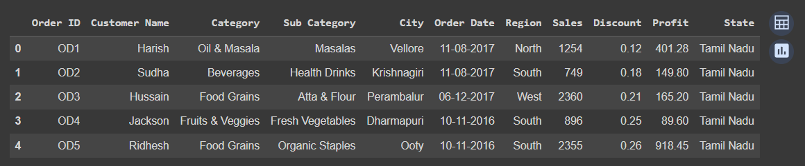

Selanjutnya kita ubah format order date menggunakan fungsi to_datetime
```python
df['Order Date'] = pd.to_datetime(df['Order Date'], errors='coerce', infer_datetime_format=True)
print(df['Order Date'])
```
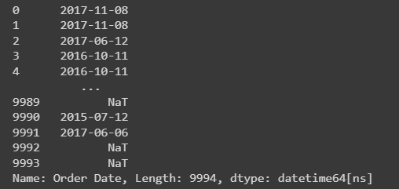
Mari kita cek dengan memanggil script seperti di bawah:
```python
df["Order Date"].dtype
df.dtypes
```
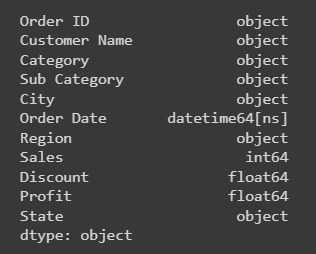
Kolom order date sudah berubah formatnya menjadi datetime64[ns]

Step selanjutnya kita akan ekstrak informasi tanggal dari kolom order date dalam dataframe menggunakan properti dt yang disediakan oleh pandas
```python
df["month"] = df['Order Date'].dt.month
df["day"] = df['Order Date'].dt.weekday
df["year"] = df['Order Date'].dt.year

print(df.head())
```
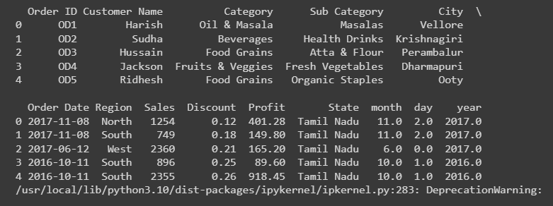

Di langkah ini, kita akan mengetahui berapa banyak kolom dan baris yang ada di dataset
```python
print('Number of rows:', df.shape[0])
print('Number of columns:', df.shape[1])
```
Baris ada 9994 dan kolom ada 14

Kita akan coba untuk melihat apakah ada nilai kosong (NaN/NaT) di dalam kolom dataframe
```python
print(df.isnull().sum())
```
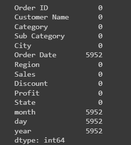

Untuk mengetahui info dari isi dataset kita, coba untuk gunakan script di bawah untuk menampilkan informasi lebih rinci
```python
df.info()
```
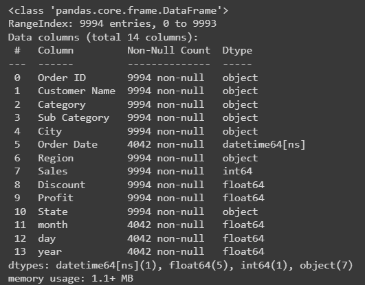

Selanjutnya kita akan gunakan fungsi seperti di bawah untuk menampilkan jumlah nilai unik yang berbeda dalam setiap kolom
```python
df.nunique()
```
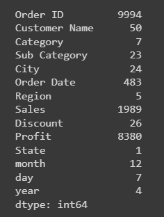

Dan kita gunakan fungsi di bawah ini untuk melihat ringkasan statistik dari dataframe
```python
df.describe()
```
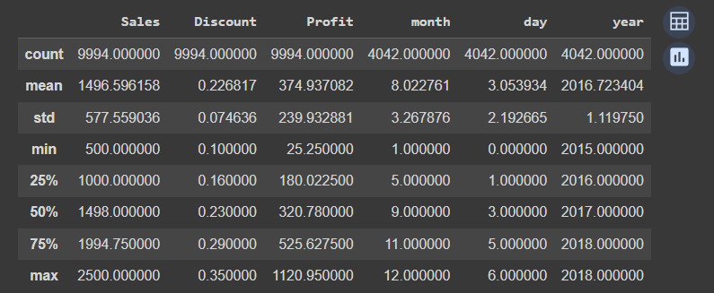

Fungsi di bawah berguna untuk mencetak nilai hitungan masing-masing kombinasi dari kolom 'category', 'sub category', dan 'city'
```python
print(df[['Category','Sub Category','City']].value_counts().to_markdown())
```
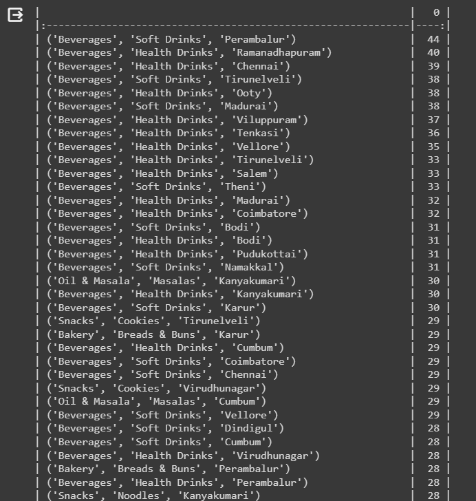
Dan untuk melihat frekuensi masing-masing kombinasinya adalah menggunakan fungsi seperti di bawah
```python
freq=df[['Category','Sub Category','City']].value_counts().reset_index()
freq=freq.rename(columns={0: 'frequency'})
freq
```
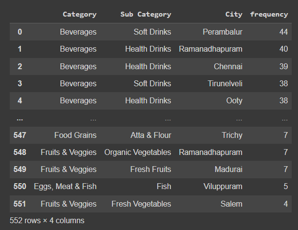

Selanjutnya kita menghitung jumlah kemunculan setiap nilai dalam kolom 'category'
```python
cat_counts = df["Category"].value_counts()
cat_counts.tail(10)
```
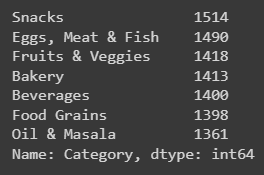
Untuk melihat indeks dari entri di cat_counts yang memiliki nilai kurang dari 2, kita gunakan fungsi seperti di bawah
```python
excluded = list(cat_counts[cat_counts.values < 2].index)
```

Selanjutnya kita ke EDA atau Exploratory Data Analysis

Di bagian pertama kita akan coba menganalisis sales by category dan sub category
```python
category_sales = df.groupby(['Category', 'Sub Category'])['Sales'].sum().reset_index()
```
Untuk menampilkan bar chart total sales by category, kita langsung saja menggunakan fungsi di bawah ini
```python
fig = px.bar(category_sales, x='Category', y='Sales', color='Sub Category', title='Total Sales by Category')
fig.show()
```
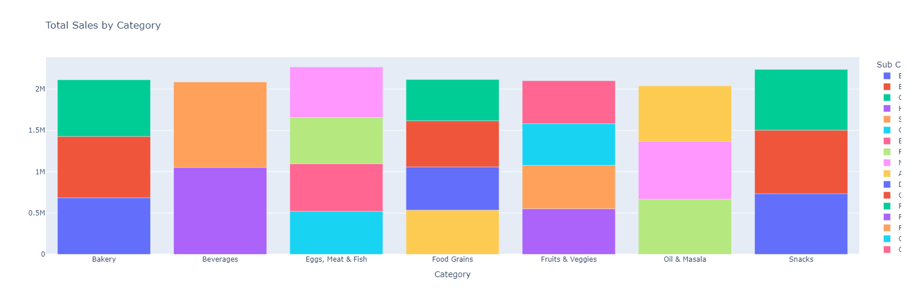
Gunakan fungsi ini untuk melihat total sales by sub category menggunakan pie chart
```python
fig = px.pie(category_sales, values='Sales', names='Sub Category', title='Total Sales by Sub Category')
fig.show()
```
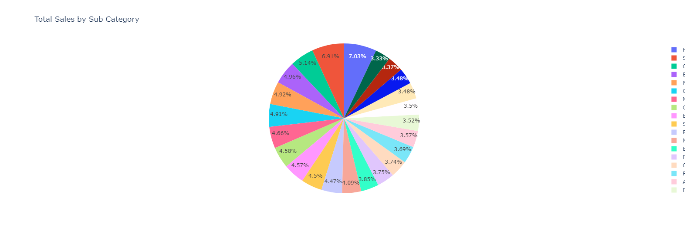

Kedua, kita akan menganalisis profit by category dan sub category
```python
category_profit = df.groupby(['Category', 'Sub Category'])['Profit'].sum().reset_index()
```
Selanjutnya kita tampilkan total profit by category menggunakan bar chart
```python
fig = px.bar(category_profit, x='Category', y='Profit', color='Sub Category', title='Total Profit by Category')
fig.show()
```
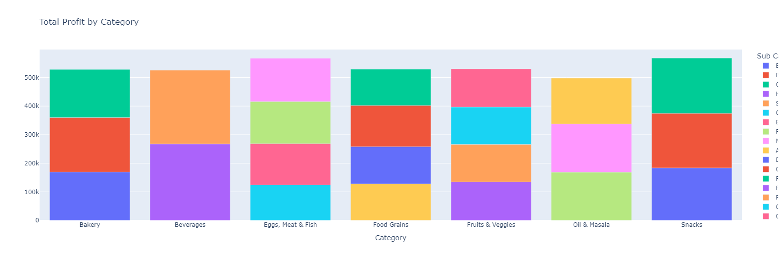
Lalu tampilkan total profit by sub category menggunakan pie chart
```python
fig = px.pie(category_profit, values='Profit', names='Sub Category', title='Total Profit by Sub Category')
fig.show()
```
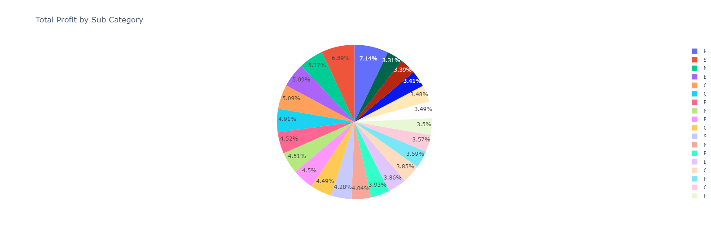

Selanjutnya kita analisis sales dan profit by region
```python
sales_by_region = df.groupby('Region')['Sales'].sum().reset_index()
profit_by_region = df.groupby('Region')['Profit'].sum().reset_index()
```
Kita lihat hasil penggabungan nilai-nilai yang ada di kolom region
```python
sales_profit_by_region = pd.merge(sales_by_region, profit_by_region, on='Region')
sales_profit_by_region.head()
```
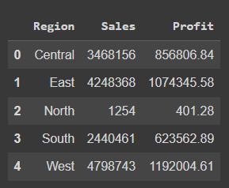
Untuk menampilkan total sales dan profit by region kita gunakan bar chart
```python
fig, ax = plt.subplots()
ax.bar(sales_profit_by_region['Region'], sales_profit_by_region['Sales'], label='Sales')
ax.bar(sales_profit_by_region['Region'], sales_profit_by_region['Profit'], label='Profit')
ax.set_xlabel('Region')
ax.set_ylabel('Amount')
ax.set_title('Total Sales and Profit by Region')
ax.legend()
plt.show()
```
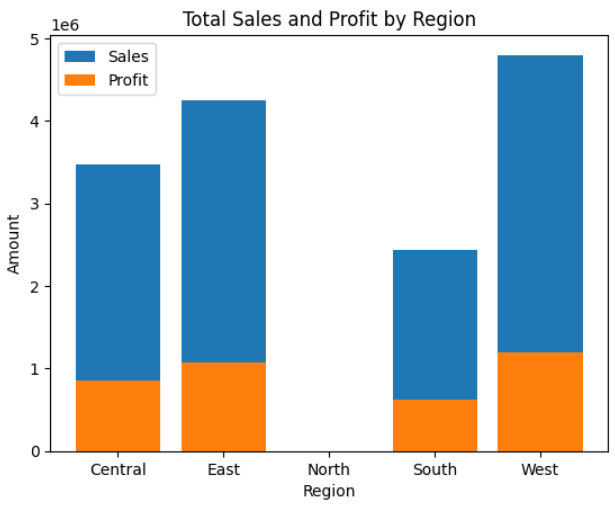

Di tahap ini, kita coba untuk analisis transaksi bulanannya menggunakan bar chart
```python
data_monthly = (
    df.groupby('month')['Order ID'].count()
    .sort_index(ascending=False)
)

plt.figure(figsize=(8, 5))
sns.barplot(x=data_monthly.index.astype(str).to_list(),
            y=data_monthly.values,
            color="#3559E0")
plt.xticks(rotation=-30, size=12)
plt.title("Monthly Transaction October-April", size=16)
plt.tight_layout()
plt.show()
```
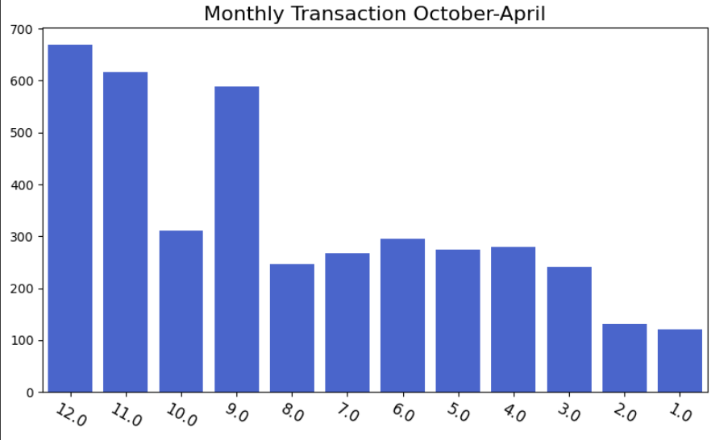
Dan fungsi ini untuk analisis transaksi harian menggunakan bar chart
```python
data_daily = (
    df.groupby('day')['Order ID'].count()
    .sort_index(ascending=False)
)

plt.figure(figsize=(8, 5))
sns.barplot(x=data_daily.index.astype(str).to_list(),
            y=data_daily.values,
            color="#FF9800")
plt.xticks(rotation=-30, size=12)
plt.title("Daily Transaction", size=16)
plt.tight_layout()
plt.show()
```
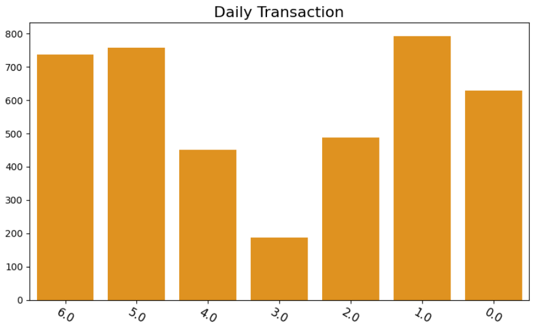
Selanjutnya kita ke tahap data discovery di mana pertama-tama kita akan membuat kolom category menjadi huruf kecil (lowercase)
```python
df["Category"] = df["Category"].apply(lambda items: items.lower())
```
Sedangkan fungsi ini digunakan untuk menghilangkan spasi pada kolom yang disebutkan
```python
df["Sub Category"] = df["Sub Category"].apply(lambda items: items.strip())
```
Di sini kita menampilkan 15 baris pertama dari dataframe yang sudah difilter dengan hanya dua kolom yang dipilih
```python
df = df[["Order ID", "Category"]].copy()
df.head(15)
```
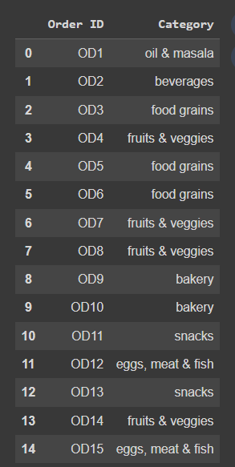
Fungsi di bawah ini untuk menampilkan 15 baris pertama dari dataframe yang menunjukan hasil perhitungan untuk melihat bagaimana data telah dikelompokkan dan dihitung
```python
cat_counts = df.groupby(["Order ID", "Category"])["Category"].count().reset_index(name="Count")
cat_counts.head(15)
```
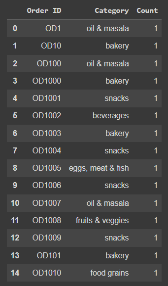
Untuk melihat lima baris pertama dari pivot table yang telah dibentuk untuk melihat strukturnya, kita gunakan fungsi di bawah
```python
cat_count_pivot = cat_counts.pivot_table(index='Order ID', columns='Category', values='Count', aggfunc='sum').fillna(0)
print("Dataset Size:", cat_count_pivot.shape)
cat_count_pivot.head()
```
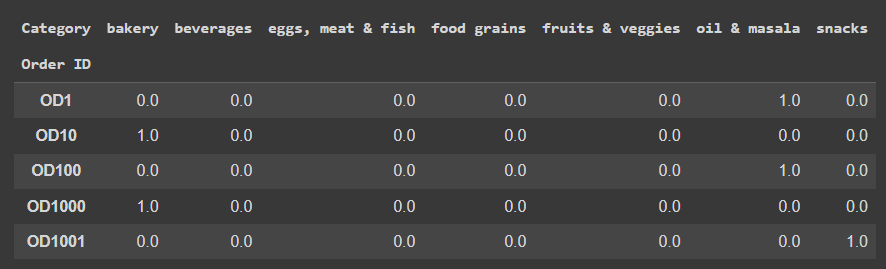
Hasilnya masih 0.0, 1.0 dan seterusnya

Untuk mengubah data tersebut kita coba gunakan fungsi ini
```python
cat_count_pivot = cat_count_pivot.astype("int32")
cat_count_pivot.head()
```
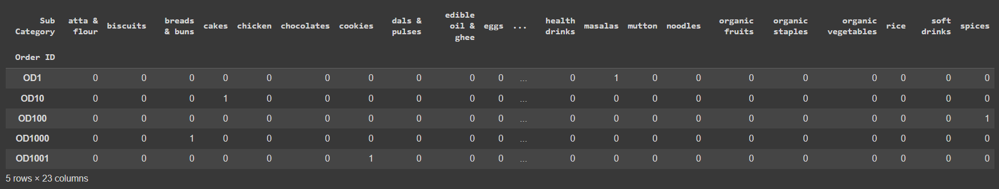
Hasilnya sudah berubah dengan hanya menampilkan angka 1 dan 0

Nah, fungsi di bawah ini untuk konversi nilai-nilai dalam dataframe tadi, jika nilainya kurang dari atau sama dengan 0, fungsi akan mengembalikan nilai 0, tapi jika nilai lebih besar dari atau sama dengan 1, fungsi akan mengembalikan nilai 1
```python
def encode(x):
  if x <=0:
    return 0
  elif x >= 1:
    return 1

cat_count_pivot = cat_count_pivot.applymap(encode)
cat_count_pivot.head()
```

Untuk mencetak ukuran dataframe, jumlah total transaksi, dan jumlah kolom dalam dataframe, kita coba gunakan fungsi di bawah ini
```python
print("Dataset Size: ", cat_count_pivot.shape)
print("Total Transaksi: ", cat_count_pivot.shape[0])
print("Total Items: ", cat_count_pivot.shape[1])
```

Selanjutnya kita ke modeling menggunakan algoritma apriori yaa
pertama-tama kita mengatur threshold support minimum yang diperlukan untuk itemset muncul dalam hasil
```python
support = 0.01
freq = apriori(cat_count_pivot, min_support = support, use_colnames = True)
freq.sort_values("support", ascending=False).head(15)
```
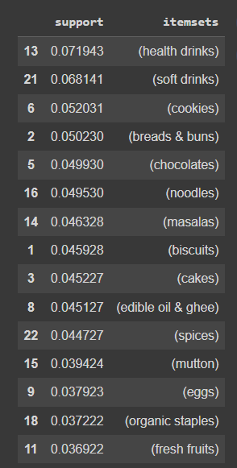
Kita gunakan minimal supportnya adalah 0.01

Kita akan coba menentukan metrik untuk mengukur kekuatan hubungan antara aturan asosiasi yang dihasilkan
```python
metric = "lift"
min_threshold = 1

rules = association_rules(freq, metric=metric, min_threshold=min_threshold)[["antecedents", "consequents", "support", "confidence", "lift"]]

rules.sort_values('confidence', ascending=False, inplace=True)

rules.head(15)
```
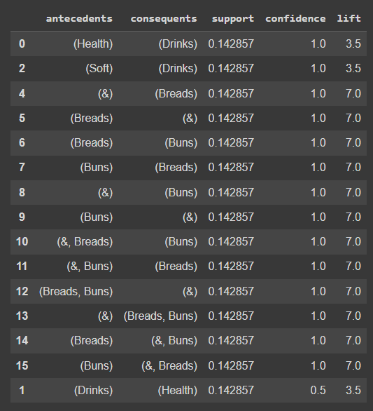
Di sini kita gunakan metrik "lift"

Selanjutnya kita coba visualisasikan hasil modeling tadi dengan fungsi di bawah ini
```python
sns.set(style = "whitegrid")
fig = plt.figure(figsize=(12, 12))
ax = fig.add_subplot(projection = '3d')


x = rules['support']
y = rules['confidence']
z = rules['lift']

ax.set_xlabel("Support")
ax.set_ylabel("Confidence")
ax.set_zlabel("Lift")

ax.scatter(x, y, z)
ax.set_title("3D Distribution of Association Rules")

plt.show()
```
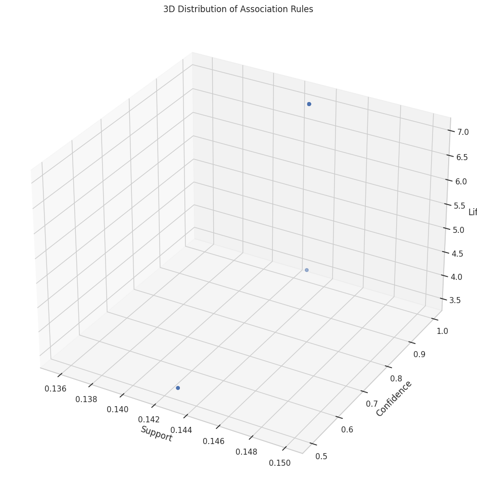

Kita coba menggunakan network graph
```python
def draw_network(rules, rules_to_show):
    network = nx.DiGraph()
    for i in range(rules_to_show):
        network.add_nodes_from(["R" + str(i)])
        for antecedents in rules.iloc[i]['antecedents']:
            network.add_nodes_from([antecedents])
            network.add_edge(antecedents, "R" + str(i), weight=2)

        for consequents in rules.iloc[i]['consequents']:
            network.add_nodes_from([consequents])
            network.add_edge("R" + str(i), consequents, weight=2)

    color_map = []

    for node in network:
        if re.compile("^[R]\d+$").fullmatch(node) is not None:
            color_map.append('black')
        else:
            color_map.append('orange')

    pos = nx.spring_layout(network, k=16, scale=1)

    nx.draw(network, pos, node_color=color_map, font_size=8)

    for p in pos:
        pos[p][1] += 0.12

    nx.draw_networkx_labels(network, pos)

    plt.title("Network Graph for Association Rules")
    plt.show()

draw_network(rules, 7)
```
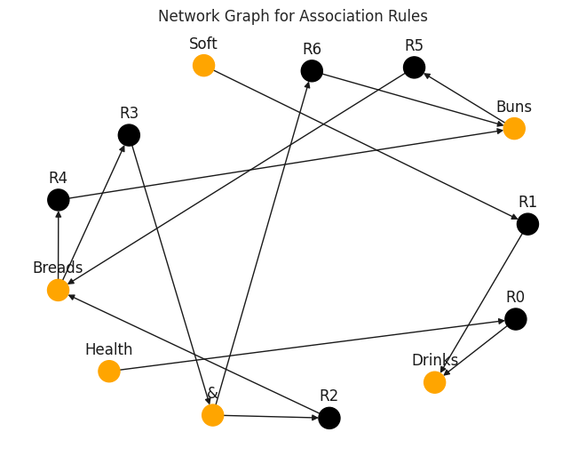
## Deployment
https://app-klasifikasi-wine.streamlit.app/

